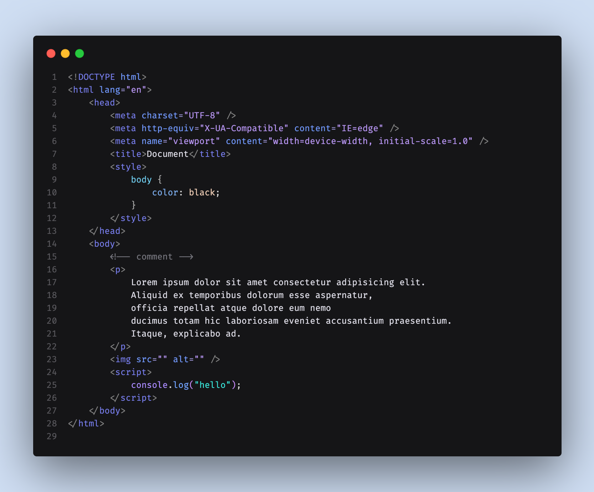
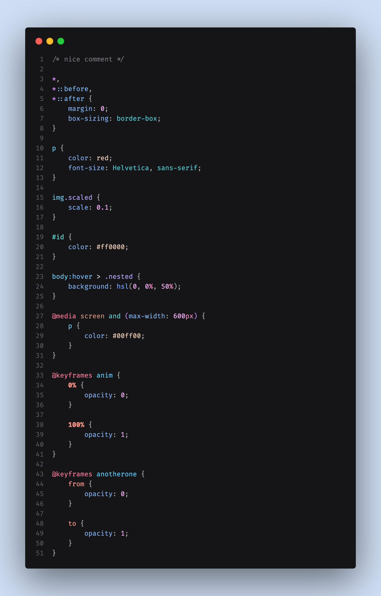
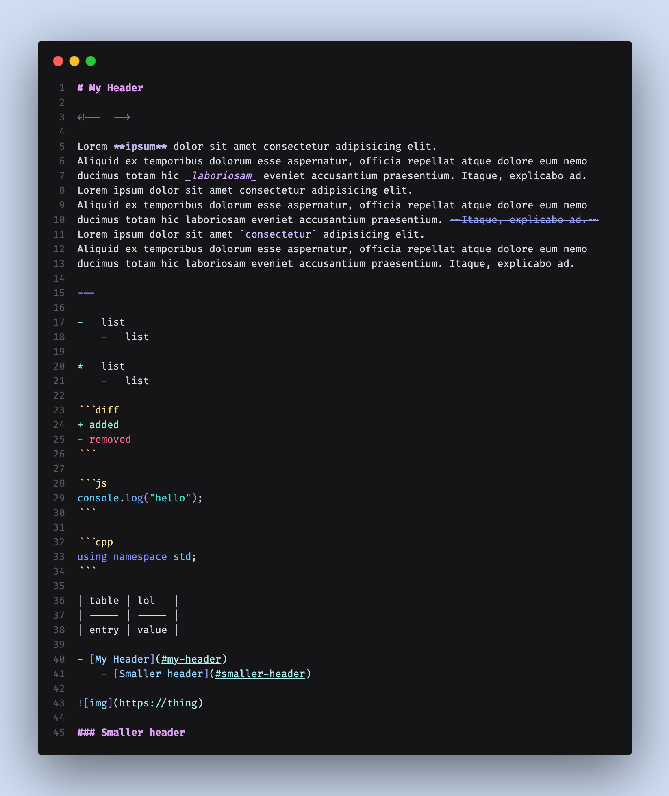

# Nebula

> Float away in space with a beautiful blurple oriented color theme.

###### DISCLAIMER: ⚠️ This theme is not as high contrast as other themes.

A pleasing darker theme made mostly with complementary purple and blue colors,
occasionally with a touch of pink or red.
Originally designed for web languages, but works well with others.

### Variants

| Label           | Description                                                                      |
| --------------- | -------------------------------------------------------------------------------- |
| Nebula Original | Original Nebula theme with a variety of colors. Vibrant and higher contrast.     |
| Nebula Simple   | Simplified version of Nebula+ with only a handful of colors with lower contrast. |
| Nebula Inferno  | An eye-popping variation centered on red and pink instead of blue and purple.    |

### Preview (Nebula Simple variant) [v0.1.0]

**You can preview this theme live in the browser [here](https://vscode.dev/theme/kelsny.nebsies) before installing it.**

    
TypeScript

    

    
HTML

    

    
CSS

    

    
Markdown

    

### Supported languages

-   `😃` JavaScript/TypeScript (including JSX/TSX)
-   `😃` HTML/CSS (as well as style/script tags)
-   `😃` Markdown
-   `🙂` Svelte/Vue
-   `🙂` XML/YAML
-   `🙂` Python
-   `🙂` C/C++
-   `🙂` Rust
-   `😐` Java
-   `😐` C#
-   `😐` Ruby
-   `😐` Go
